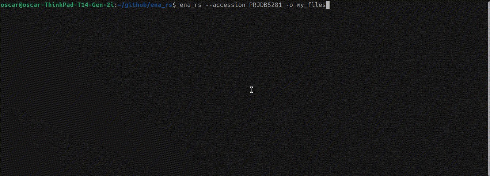

# ena_rs
CLI tool for working with ENA data. Download FASTQ files or get a metadata summary.

## Requirements
- Linux OS (Ubuntu 24.04.2)
- Rust >= 1.90.0

## Install
The easiest way to get started is to download a precompiled Linux binary from the latest [release](https://github.com/OscarAspelin95/ena_rs/releases).

## Install from source
Clone the repository or download the source code. Enter the ena_rs directory and run: 

`cargo build --release`

The generated binary is available in `target/release/ena_rs`.

## Usage

### Download FASTQ files
`ena_rs download --accession <accession> --outdir <outdir>`

<pre>
<b>--accession</b> An ENA project, sample or run accession.
<b>--outdir</b> Output directory.
</pre>

### Summarize metadata
`ena_rs summary --accession <accession> [--output <file>]`

<pre>
<b>--accession</b> An ENA project, sample or run accession.
<b>--output</b> Output file path for summary JSON. Defaults to stdout.
</pre>

## Roadmap
- Add support for providing multiple accessions.
- Add filtering options for e.g., platform, fastq byte size, etc.
- Streaming support for large files.
- Add dynamic timeout based on fastq byte size.

